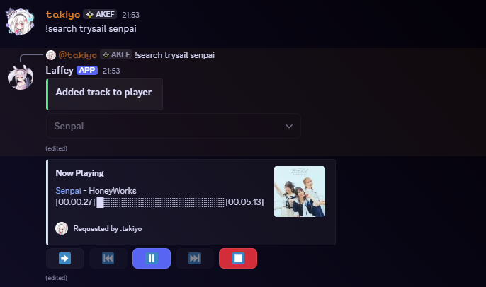
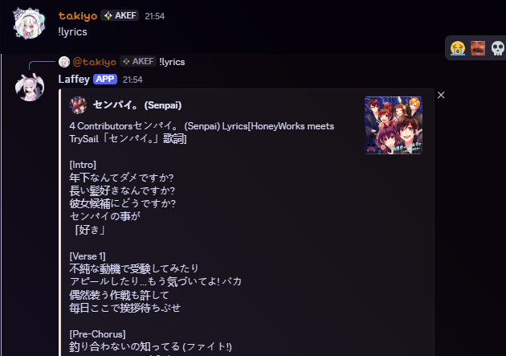

# Laffey

#### An adorable lavalink discord music bot that has a lot of features inside it.


> © Azur Lane | First Project of [Weeb-Devs](https://www.github.com/Weeb-Devs)

## Features:

✓ High quality  
✓ Supports 9 filters  
✓ Auto resume on restart  
✓ Stable  
✓ Feature-rich  
✓ Supports both slash commands and message commands   
✓ Highly customizable   
✓ and of course, adorable shipgirl

## Getting Started

### Requirements

- LTS Node.js is highly recommended
- **Lavalink server**: See [LAVALINK_INSTALLATION.md](readme/LAVALINK_INSTALLATION.md)

### Step 1: Create your Discord Bot

1. Go to [Discord Developer Portal](https://discord.com/developers/applications)
2. Create a new application and add a bot
3. Copy your bot token (you'll need this)

### Step 2: Configure Laffey

**Choose one of two ways to configure:**

#### Option A: Using config.json (Recommended for beginners)

1. Rename `config.json.example` to `config.json`
2. Fill in your bot token, ID, and other settings
3. See [CONFIG_GUIDE.md](readme/CONFIG_GUIDE.md) for complete documentation

#### Option B: Using Environment Variables (Recommended for Docker)

1. Set up environment variables in your deployment
2. See [CONFIG_GUIDE.env.md](readme/CONFIG_GUIDE.env.md) for complete documentation

### Step 3: Install & Run

**On Bare Machine:**

```bash
npm install
npm start
```

**Using Docker:**

Choose one of the pre-configured `docker-compose` files based on your needs:

| File                              | Database   | Config                | Best For                      |
|-----------------------------------|------------|-----------------------|-------------------------------|
| `docker-compose.env.yml`          | SQLite     | Environment Variables | **Quick start (recommended)** |
| `docker-compose.yml`              | SQLite     | config.json           | Traditional setup             |
| `docker-compose.postgres.env.yml` | PostgreSQL | Environment Variables | Production with env vars      |
| `docker-compose.postgres.yml`     | PostgreSQL | config.json           | Production with file config   |

**Quickest way to start:**  
Edit `docker-compose.env.yml` and fill in your bot token and ID. Then run:

```bash
docker-compose -f docker-compose.env.yml up -d
```

See [DOCKER_SETUP.md](readme/DOCKER_SETUP.md) for detailed instructions

---

## Configuration

Laffey supports two configuration methods:

- **config.json** - Traditional file-based (see [CONFIG_GUIDE.md](readme/CONFIG_GUIDE.md))
- **Environment Variables** - Best for Docker (see [CONFIG_GUIDE.env.md](readme/CONFIG_GUIDE.env.md))

Slash command registration is automatic based on your `slash.register` setting in config.

---

## Available Music Sources

- YouTube
- Bandcamp
- SoundCloud
- Twitch
- Vimeo
- HTTP/Radio
- Spotify
- Deezer

**Note:** Availability depends on your Lavalink server configuration

## Screenshots




## Commands

### Music Commands

| Command       | Description                                  | Example                           |
|---------------|----------------------------------------------|-----------------------------------|
| `/play`       | Play a song from various sources             | `/play never gonna give you up`   |
| `/search`     | Search for a song                            | `/search despacito`               |
| `/nowplaying` | Show the currently playing song and progress | `/nowplaying`                     |
| `/queue`      | Display the music queue                      | `/queue`                          |
| `/skip`       | Skip the current song                        | `/skip`                           |
| `/jump`       | Jump to a specific song position in queue    | `/jump 3`                         |
| `/previous`   | Play the previously played song              | `/previous`                       |
| `/seek`       | Seek to a position in the current track      | `/seek 1:30`                      |
| `/pause`      | Pause the music                              | `/pause`                          |
| `/stop`       | Stop music and clear queue                   | `/stop`                           |
| `/loop`       | Toggle loop mode (off/track/queue)           | `/loop`                           |
| `/shuffle`    | Shuffle the queue                            | `/shuffle`                        |
| `/volume`     | Set player volume (0-1000)                   | `/volume 100`                     |
| `/move`       | Move a song to a different position          | `/move 2 5`                       |
| `/remove`     | Remove a song from queue                     | `/remove 3`                       |
| `/clear`      | Clear the entire queue                       | `/clear`                          |
| `/join`       | Join a voice channel                         | `/join`                           |
| `/leave`      | Leave the voice channel                      | `/leave`                          |
| `/24h`        | Toggle auto-leave when channel is empty      | `/24h`                            |
| `/lyrics`     | Get lyrics for a song or now playing         | `/lyrics never gonna give you up` |

### Effect/Filter Commands

| Command             | Description                                        | Example                |
|---------------------|----------------------------------------------------|------------------------|
| `/effect bassboost` | Set bass boost effect (0-100)                      | `/effect bassboost 50` |
| `/effect nightcore` | Apply nightcore effect                             | `/effect nightcore`    |
| `/effect distort`   | Apply distort effect                               | `/effect distort`      |
| `/effect karaoke`   | Apply karaoke effect                               | `/effect karaoke`      |
| `/effect vaporwave` | Apply vaporwave effect                             | `/effect vaporwave`    |
| `/effect 8d`        | Apply 8D audio effect                              | `/effect 8d`           |
| `/effect speed`     | Adjust playback speed                              | `/effect speed 1.5`    |
| `/effect pitch`     | Adjust audio pitch                                 | `/effect pitch 1.2`    |
| `/effect rate`      | Adjust audio rate                                  | `/effect rate 1.2`     |
| `/effect reset`     | Reset all effects                                  | `/effect reset`        |
| `/effect list`      | Show all available effects and their current state | `/effect list`         |

### Miscellaneous Commands

| Command   | Description                    | Example                    |
|-----------|--------------------------------|----------------------------|
| `/ping`   | Get bot's ws latency           | `/ping`                    |
| `/help`   | Show all available commands    | `/help`                    |
| `/invite` | Get invite link for the bot    | `/invite`                  |
| `/nodes`  | Show Lavalink node information | `/nodes`                   |
| `/eval`   | Execute code (owner only)      | `/eval ctx.client.ws.ping` |

## Description & About

Created at: Friday, 2 April 2021  
Published at: Sunday, 11 April 2021  
[Laffey](https://github.com/Weeb-Devs/Laffey) is [Weeb-Devs](https://github.com/Weeb-Devs) 's first project. It was
created
by our first member aka owner, Takiyo. He really wants to make his first open source project ever. Because he wants more
coding experience. In this project, he was challenged to make a project with less bugs. Hope you enjoy using Laffey!
