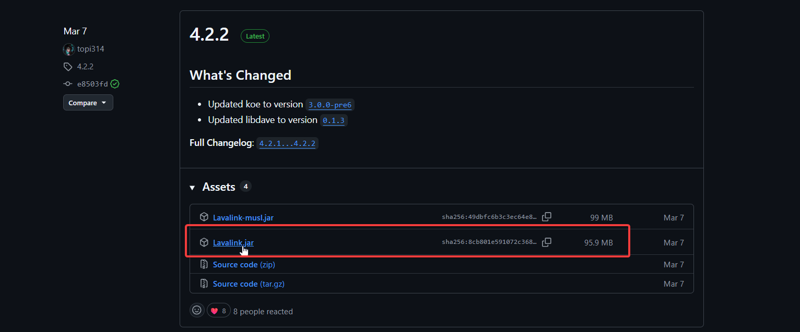
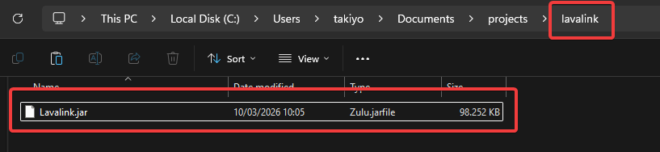
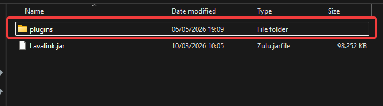
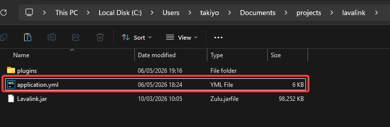
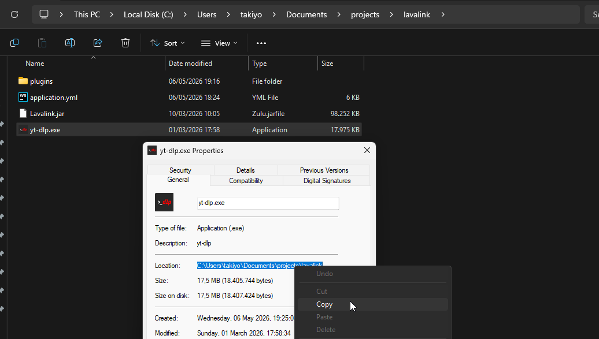
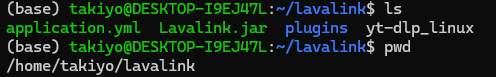
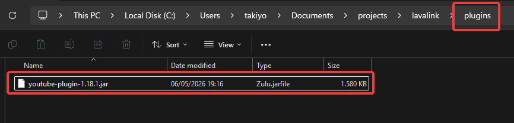

# Lavalink Installation

### Here, i will give you tutorial how to set up lavalink server on your pc or VPS. I'll do it on localhost, the steps are the same for VPS.

## Step by Step

1. Download lavalink.jar through [Lavalink's GitHub](https://github.com/lavalink-devs/Lavalink/releases)
   
    
2. Move it to an empty folder
   
    
3. Create a folder named `plugins` within the folder that you just created
   
4. Download [application.yml](examples/application.yml) and
   move the `application.yml` to the lavalink folder    
   

## Now you choose either 2 options:

### a. Use lavasrc youtube (ytdl)

This is the easiest option, as you don't need to modify clients and or refresh_token.

1. Open `application.yml`, find `plugins: youtube: enabled` and set to `false`.
2. On the same file, find `plugins: lavasrc: sources: youtube` and set to `true`.
3. Download ytdl from https://github.com/yt-dlp/yt-dlp/releases, pick based on your OS and architecture. The most common
   are windows: `yt-dlp.exe`, macos: `yt-dlp_macos`, linux: `yt-dlp_linux`
4. Move the downloaded ytdl to the lavalink folder
5. Get the full path of the ytdl file, e.g., windows:
    `C:\Users\takiyo\Documents\projects\lavalink\yt-dlp.exe`  
   linux:
    `/home/takiyo/lavalink/yt-dlp_linux`
6. On `application.yml`, replace `FULL_PATH_TO_YTDL` on `plugins: lavasrc: ytdlp: path` to the full path that you just
   got
7. Run the lavalink server with `java -jar Lavalink.jar`

### b. Use youtube-source plugin

1. Go to [YouTube Source's GitHub](https://github.com/lavalink-devs/youtube-source/releases) and download the
   `youtube-plugin-<VERSION>.jar`
    
2. Move the downloaded `youtube-plugin-<VERSION>.jar` to the `plugins` folder that you just created  
      
    
3. Open `application.yml`, find `plugins: youtube: enabled` and set to `true`.
4. On the same file, find `plugins: lavasrc: sources: youtube` and set to `false`.
5. You can keep the `plugins: youtube: clients` as is, but you might need to get the `refresh_token` by yourself.
6. Run the lavalink server with `java -jar Lavalink.jar`

## Last step

As we need three fields for the bot to run, which are `name`, `url`, and `auth`, get each of them by:

- `name` name it whatever you want
- `url` the url where the lavalink server is running (`host:port`). Host is usually `localhost` or your VPS's IP
  address, and the port is the one you set on `application.yml` (default: 3490). So that would be `localhost:3490` or
  `your-vps-ip:3490`
- `auth` the password you set on `application.yml` at `lavalink: server: password` (default: `securepassword`). Change
  it if you plan to host lavalink publicly

### Found something wrong? Feel free to make a pull request or submitting an issue from this tutorial. Thank you
